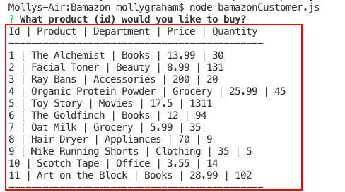
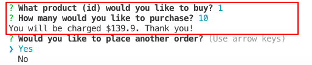

# Bamazon
Homework assignment for module #11 (U.T. Coding Bootcamp)

## Motivation
I created this program to gain experience in both writing a command line node app and utilizing mySQL.

## How to Use
There are two modes to this program. One allows the user to place an order as a "Bamazon" customer. The other allows the user to act as a manager for "Bamazon." As a manager, the user has the abiltiy to:
* View Products for Sale
* View Low Inventory
* Add to Inventory
* Add New Product

### Bamazon Customer Mode
In order to run the customer mode of the program, type "node bamazoncustomer.js" into the command line. You should see a list of products that are in the database. The details included are:
* ID of product
* Name of product
* Department of product
* Price of product
* Quantity in stock

As a customer, you are able to select a product by ID and purchase it. Once you do this, the quantity in stock decreases. You are also given the total you owe based on the price per unit and quantity selected.

#### EXAMPLE
 

### Bamazon Manager Mode
In order to run the customer mode of the program, type "node bamazonmanager.js" into the command line. You should see the menu mentioned above. Select what action you'd like to take as the manager (view all products, view the ones with an inventory less than 5, add to a product's inventory, add an entirely new product).

#### EXAMPLE
![manager-menu] (images/manager-1-view.png)

![manager-table] (images.manager-2-view.png)

![manager-low] (manager-3-low)

![manager-add-inventory] (manager-4-inventory)

![manager-add-product] (manager-5-add)

## Technology Used
* Node.js
* Inquirer library
* mySQL

### Portfolio
**If you'd like to see more of my work, check out my portfolio at https://mollyclaire.github.io/Responsive-Portfolio/**